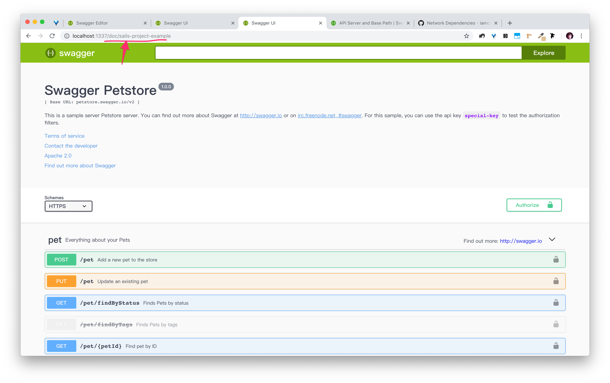

# sails-hook-swagger-ui



A Sails hook which to generate routes `/doc` and `/doc/{your_micro_app_name}` in order to provide Swagger UI support for each Sails Micro-Apps(fka, hooks). Each micro-app will have different Swagger documentation, which is a really good idea for API driven development.

Let's getting started! Just install this plugin and put your Swagger JSON file under the micro-app's root path, and enjoy the documentation.

## Requirement

- Swagger 2.x~3.0 in JSON format
- Sails 1.x basement
- Sails hook `sails-util-micro-apps` installed
- use micro-apps pattern, which means each micro-app has its own swagger definition.

## Installation

- Install plugin

`sails-hook-swagger-ui` is super easy to install.

```shell
// because your are using sails micro-app, so you have to install this first.
npm install sails-util-micro-apps

npm install sails-hook-swagger-ui
```

- Setup the swagger json file path

```javascript
import path from 'path';
import swagger from './swagger.json'; // import or require yor swagge here

module.exports = function (sails) {
    var loader = require('sails-util-micro-apps')(sails);

    return {
      swagger,  // put swagger here
      configure() {
        loader.configure({
          assets: `${__dirname}/assets`,
          views: `${__dirname}/views`,
          policies: `${__dirname}/api/policies`, // Path to your hook's policies
          config: `${__dirname}/config`, // Path to your hook's config
        });
      },
      initialize(next) {
        loader.inject({
          responses: `${__dirname}/api/responses`,
          models: `${__dirname}/api/models`, // Path to your hook's models
          services: `${__dirname}/api/services`, // Path to your hook's services
          controllers: `${__dirname}/api/controllers`, // Path to your hook's controllers
        }, err => next(err));
      },
    };
};

```

## Usage

After you installed the plugin, you can redirect to `{you_sails_app_root_path_and_port}`/doc/`${you_micro_app_folder_name}` to see you Swagger documentation.

if you like to have a default `/doc` documentation, setup the config json to get better flexibility.

## Configuration

`sails-hook-swagger-ui` has a simple config file that outputted for you.

so you can decided to enable this plugin or not, or change the default entry `/doc` to load the swagger documentation you want.

```javascript
module.exports['swagger-ui'] = {
  // To control this sails hook enable or not.
  enable: true,
  // Give a default sails project name(which is the folder name of target hook), or keep it null to set no default one.
  // default: 'sails-app-my-awesome-app'
  default: null,
};
```